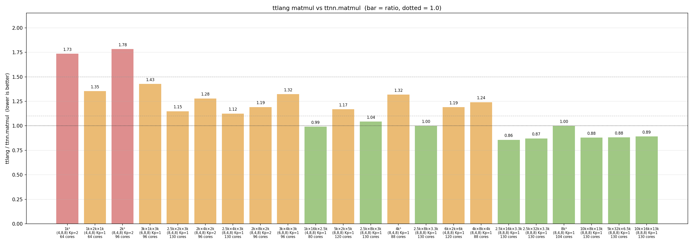

# Matmul benchmark

Sweeps a ksplit/SUMMA matmul against `ttnn.matmul` across shapes. **All inputs and outputs are DRAM interleaved.**

Bars show `ttlang / ttnn.matmul` wall time (lower is better). Green < 1.1,
orange < 1.5, red otherwise. To regenerate: `python3 sweep.py` (writes
`/tmp/ksplit_sweep.csv` and the PNG alongside it).

Exclusively tested and tuned on single Blackhole card with 130 cores.

## Kernels

Two kernels cover the `K_parts` axis:

- `summa_kernel.py` for `Kp == 1`. Grid is `(Np, Mp)`; each core owns an
  output tile-block and reduces over the full K axis locally.
- `ksplit_kernel.py` for `Kp >= 2`. Grid is `(Np * Kp, Mp)`. The K-space is
  partitioned across `Kp` column-groups; each group runs an independent
  SUMMA over its K-slab, then gathers partials.

`sweep.py` dispatches to `summa_kernel` when the plan picks `Kp == 1` and to
`ksplit_kernel` otherwise.

## Multicast

Both kernels use the same two mcast nets:

- **A (activations) row-mcast**: the core at column 0 of each row reads an A
  block from DRAM and multicasts it across the row to all `Np` consumers in
  that row.
- **B (weights) column-mcast**: the core at row 0 of each column reads a B
  block and multicasts it down the column to all `Mp` consumers.

So each A block is read once per row and each B block once per column; every
other core receives over the on-chip mcast net instead of hitting DRAM. In
`ksplit_kernel` these nets are replicated per K-group (`Kp` independent A
row-mcasts and `Np * Kp` independent B column-mcasts), since each group
works on a disjoint K-slab.

## Gather (ksplit only)

After compute, each non-root core (`k_p > 0`) at logical position
`(k_p * Np + n_p, m_p)` sends its partial sum to the root core at
`(n_p, m_p)` (i.e. `k_p == 0`) via a dedicated `reduce_net`. The root
receives `Kp - 1` partials, sums them into its own partial, and writes the
final block to DRAM. Only root cores touch the output tensor.

## Config

`config.py` exposes `plan_matmul(M, K, N)` which returns a `MatmulPlan` with
`block_cfg = (bm, bn, bk)` (tile-block dims) and `part_cfg = (Mp, Np, Kp)`
(grid partitioning).

`SHAPE_PLANS` is a hand-picked override table for shapes in the sweep;
shapes not in the table fall through to a heuristic that scores candidate
`(block, part)` pairs on core utilization, padding overhead, and per-core
iteration count. The sweep's shape list and timing convention live in
`sweep.py`; `sweep_baseline.py` reproduces the old `bench_matmul_sweep.py`
heuristic for comparison.
