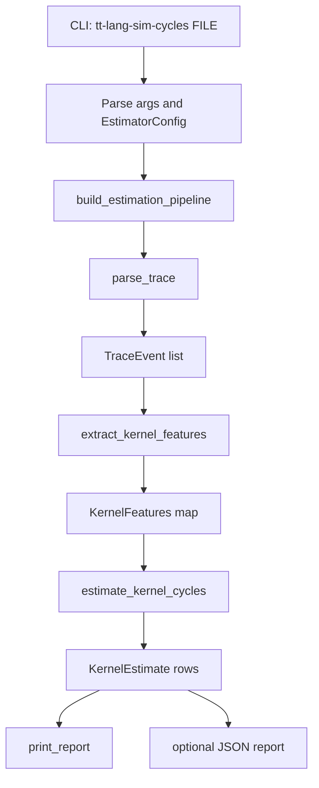

# Cycle Estimator Process Flow (v0.1)

This document describes the current end-to-end process flow for
`tt-lang-sim-cycles`.

Implementation is organized as:

- `python/sim_stats/cycle_estimator.py` (compatibility shim and entry module)
- `python/sim_stats/cycle_tools/cli.py` (CLI wiring)
- `python/sim_stats/cycle_tools/parse.py` (trace parsing and feature extraction)
- `python/sim_stats/cycle_tools/model.py` (estimation and grouping)
- `python/sim_stats/cycle_tools/report.py` (terminal and JSON reporting)
- `python/sim_stats/cycle_tools/types.py` (dataclasses)

## Quick Workflow (v0.1)

The repository includes a higher-level cycle estimator for simulator traces:

```bash
tt-lang-sim-cycles trace.jsonl
```

The estimator is phase-duration-first (with roofline as secondary context) and
reports per-kernel metrics:

- estimated cycles
- measured cycles
- prediction error percentage
- roofline efficiency
- operational intensity
- compute-bound vs memory-bound classification

Example with explicit model parameters and JSON export:

```bash
tt-lang-sim-cycles trace.jsonl \
  --flops-per-tile 2048 \
  --bytes-per-tile 2048 \
  --peak-flops-per-cycle 4096 \
  --memory-bytes-per-cycle 1024 \
  --json-out cycle_report.json
```

This v0.1 tool is intended for explainable kernel-level estimation. Lower-level
Tensix-specific refinement should only be added when mismatch analysis indicates
that the higher-level model is insufficient.

---
## Scope

The current implementation is a higher-level estimator for simulator traces. It
uses trace-derived phase durations as primary predictors, with roofline terms
as secondary interpretation. It is intentionally not a detailed Tensix
instruction-level model.

## End-to-End Flow



## Stage Details

### 1. CLI Entry and Config

- Entrypoints:
  - `sim_stats.cycle_estimator:main` (compatibility/export surface)
  - implementation in `sim_stats.cycle_tools.cli:main`
- Reads trace path and model knobs into `EstimatorConfig`
- Key options include:
  - roofline parameters (`flops_per_tile`, `bytes_per_tile`, peaks)
  - event costs (`wait_event_cycles`, `reserve_event_cycles`, `sync_event_cycles`)
  - phase-duration scaling (`dfb_wait_block_scale`,
    `dfb_reserve_block_scale`, `copy_duration_scale`)
  - mismatch threshold

### 2. Trace Parsing

- Function: `parse_trace(path)`
- Input: JSON Lines trace generated by `tt-lang-sim --trace`
- Output: typed `TraceEvent` list
- Behavior:
  - skips blank lines
  - warns and skips malformed JSON lines
  - normalizes core fields (`tick`, `event`, `kernel`)

### 3. Feature Extraction (Kernel-Level)

- Function: `extract_kernel_features(events)`
- Output: `dict[str, KernelFeatures]`
- Extracted features include:
  - measured cycles (from `kernel_start` to `kernel_end`)
  - blocked cycles (from `kernel_block` to `kernel_unblock`)
  - active cycles (`measured - blocked`)
  - DFB activity counts (`wait`, `reserve`, `push`, `pop`)
  - copy counts and tile movement (`local_l1`, `remote_l1`, `dram`)

### 4. Phase-Duration + Roofline Estimation

- Function: `estimate_kernel_cycles(features, config, include_zero_kernels=False)`
- Per kernel:
  - infer role: `compute`, `read`, `write`, or `other`
  - extract phase contributions from paired event durations:
    - `dfb_wait_block_contribution = dfb_wait_block_cycles * dfb_wait_block_scale`
    - `dfb_reserve_block_contribution = dfb_reserve_block_cycles * dfb_reserve_block_scale`
    - `copy_duration_contribution = copy_duration_cycles * copy_duration_scale`
  - estimate compute work:
    - `flops = compute_tiles * flops_per_tile`
  - estimate data movement:
    - `bytes_moved = memory_tiles * bytes_per_tile`
  - compute ceilings:
    - `compute_ceiling_cycles = flops / peak_flops_per_cycle`
    - `memory_ceiling_cycles = bytes_moved / memory_bytes_per_cycle`
  - roofline base:
    - `roofline_base_cycles = max(compute_ceiling_cycles, memory_ceiling_cycles)`
  - add overhead terms:
    - `stall_cycles = wait_count * wait_event_cycles + reserve_count * reserve_event_cycles`
    - `sync_cycles = (push_count + pop_count) * sync_event_cycles`
    - `copy_overhead_cycles = copy_calls * copy_call_cycles`
  - final estimate:
    - `estimated_cycles = phase_duration_terms + roofline_base_cycles + stall_cycles + sync_cycles + copy_overhead_cycles + launch_cycles`

### 5. Metrics and Classification

Per kernel metrics include:

- measured cycles
- estimated cycles
- signed and absolute error percentage
- roofline efficiency
- operational intensity
- compute-bound / memory-bound / balanced classification

### 6. Mismatch Analysis and Escalation Gate

- Function: `mismatch_reason(...)`
- Logic:
  - within threshold -> `within-threshold`
  - high blocked fraction -> `stall-dominated` (refine high-level stall/sync model first)
  - high blocked-term share in estimate -> `blocked-term-dominated`
  - unknown kernel role -> `unknown-kernel-role`
  - no work signal -> `no work signal in trace`
  - otherwise -> `roofline-parameter mismatch`
- Escalation flag (`needs_lower_level_model`) is set only when:
  - error is above threshold, and
  - reason is `roofline-parameter mismatch`

### 7. Reporting

- Terminal report (`print_report`):
  - per-kernel table
  - kernel-group (heuristic critical-path v0.1) totals
  - weighted absolute error summary
  - mismatch threshold counts
  - top mismatch notes
  - ablation diagnostics
  - feature provenance audit
  - role calibration suggestions
- Optional JSON report (`--json-out`) with full config and per-kernel rows

## Requirement Fit Check

Status against current project goals:

1. Trace parser: **Implemented**
2. Feature extraction: **Implemented**
3. Higher-level estimator: **Implemented**
4. Roofline metrics: **Implemented**
5. Estimated vs measured comparison: **Implemented**
6. Mismatch analysis: **Implemented**
7. Controlled escalation to lower-level model: **Implemented**

## Known Gaps for Long-Term Productization

1. Deterministic regression fixtures/tests for estimator outputs are not yet added.
2. Hardware-calibrated profile sets are not yet formalized.
3. Assumption and calibration documentation can be expanded for maintainers.
4. Deprecation policy for compatibility shim exports (`sim_stats/cycle_estimator.py`) is not documented.

## Suggested Next Iteration

1. Add fixed-trace tests that lock output schema and key summary metrics.
2. Add profile-based parameter presets for stable reproducibility.
3. Add a short calibration guide for tuning phase-duration and roofline constants.
4. Decide timeline for slimming or removing compatibility shim exports.
