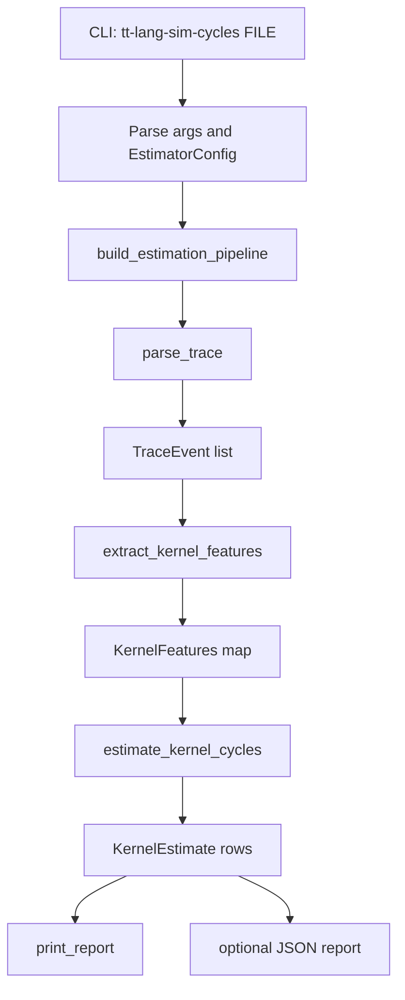

# Cycle Estimator Process Flow (v0)

This document describes the current end-to-end process flow implemented in
`python/sim_stats/cycle_estimator.py`.

## Scope

The current implementation is a higher-level, roofline-style estimator for
simulator traces. It is intentionally not a detailed Tensix instruction-level
model.

## End-to-End Flow

## Stage Details

### 1. CLI Entry and Config

- Entry point: `main()`
- Reads trace path and model knobs into `EstimatorConfig`
- Key options include:
  - roofline parameters (`flops_per_tile`, `bytes_per_tile`, peaks)
  - event costs (`wait_event_cycles`, `reserve_event_cycles`, `sync_event_cycles`)
  - mismatch threshold

### 2. Trace Parsing

- Function: `parse_trace(path)`
- Input: JSON Lines trace generated by `tt-lang-sim --trace`
- Output: typed `TraceEvent` list
- Behavior:
  - skips blank lines
  - warns and skips malformed JSON lines
  - normalizes core fields (`tick`, `event`, `kernel`)

### 3. Feature Extraction (Kernel-Level)

- Function: `extract_kernel_features(events)`
- Output: `dict[str, KernelFeatures]`
- Extracted features include:
  - measured cycles (from `kernel_start` to `kernel_end`)
  - blocked cycles (from `kernel_block` to `kernel_unblock`)
  - active cycles (`measured - blocked`)
  - DFB activity counts (`wait`, `reserve`, `push`, `pop`)
  - copy counts and tile movement (`local_l1`, `remote_l1`, `dram`)

### 4. Roofline-Style Estimation

- Function: `estimate_kernel_cycles(features, config, include_zero_kernels=False)`
- Per kernel:
  - infer role: `compute`, `read`, `write`, or `other`
  - estimate compute work:
    - `flops = compute_tiles * flops_per_tile`
  - estimate data movement:
    - `bytes_moved = memory_tiles * bytes_per_tile`
  - compute ceilings:
    - `compute_ceiling_cycles = flops / peak_flops_per_cycle`
    - `memory_ceiling_cycles = bytes_moved / memory_bytes_per_cycle`
  - roofline base:
    - `roofline_base_cycles = max(compute_ceiling_cycles, memory_ceiling_cycles)`
  - add overhead terms:
    - `stall_cycles = wait_count * wait_event_cycles + reserve_count * reserve_event_cycles`
    - `sync_cycles = (push_count + pop_count) * sync_event_cycles`
  - final estimate:
    - `estimated_cycles = roofline_base_cycles + stall_cycles + sync_cycles`

### 5. Metrics and Classification

Per kernel metrics include:

- measured cycles
- estimated cycles
- signed and absolute error percentage
- roofline efficiency
- operational intensity
- compute-bound / memory-bound / balanced classification

### 6. Mismatch Analysis and Escalation Gate

- Function: `_mismatch_reason(...)`
- Logic:
  - within threshold -> `within-threshold`
  - high blocked fraction -> `stall-dominated` (refine high-level stall/sync model first)
  - unknown kernel role -> `unknown-kernel-role`
  - no work signal -> `no work signal in trace`
  - otherwise -> `roofline-parameter mismatch`
- Escalation flag (`needs_lower_level_model`) is set only when:
  - error is above threshold, and
  - reason is `roofline-parameter mismatch`

### 7. Reporting

- Terminal report (`print_report`):
  - per-kernel table
  - weighted absolute error summary
  - mismatch threshold counts
  - top mismatch notes
- Optional JSON report (`--json-out`) with full config and per-kernel rows

## Requirement Fit Check

Status against current project goals:

1. Trace parser: **Implemented**
2. Feature extraction: **Implemented**
3. Higher-level estimator: **Implemented**
4. Roofline metrics: **Implemented**
5. Estimated vs measured comparison: **Implemented**
6. Mismatch analysis: **Implemented**
7. Controlled escalation to lower-level model: **Implemented**

## Known Gaps for Long-Term Productization

1. Shared parser module is not yet unified with `sim_stats/__main__.py`.
2. Hardware-calibrated profile sets are not yet formalized.
3. Deterministic regression fixtures/tests for estimator outputs are not yet added.
4. Assumption and calibration documentation can be expanded for maintainers.

## Suggested Next Iteration

1. Extract common trace IO utilities used by both `sim_stats` CLIs.
2. Add profile-based parameter presets for stable reproducibility.
3. Add fixed-trace tests that lock output schema and key summary metrics.
4. Add a short calibration guide for tuning roofline constants.
