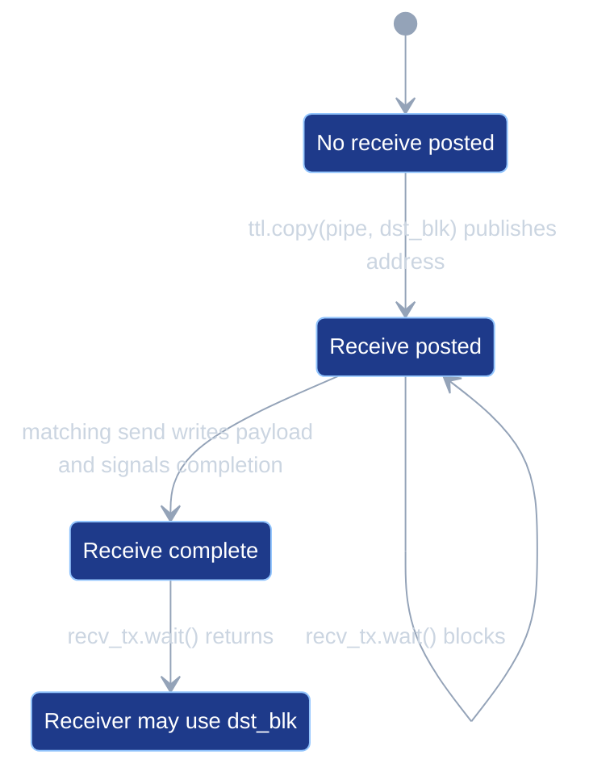
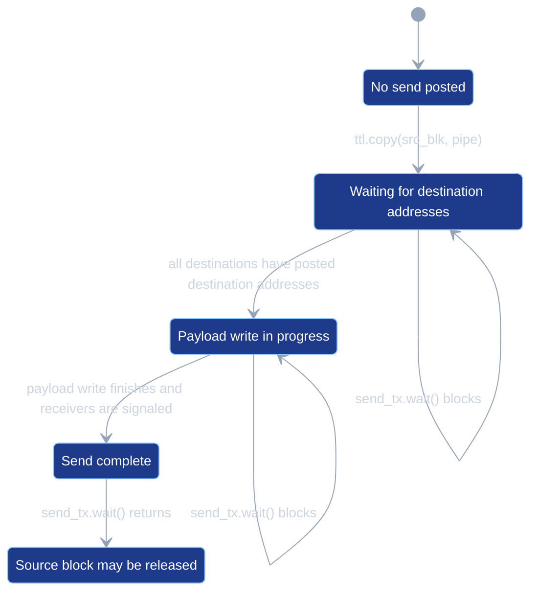

# PipeNets

This document describes how PipeNets are owned, validated, lowered, and
scheduled in tt-lang. Both the compiler and the simulator consume the
same operation-level PipeNet collection; this document covers the data
flow, PipeNet verification, simulator launch semantics, and test
coverage.

The launch grid (the grid that `@ttl.operation(grid=...)` schedules
onto) is decoupled from the *work extent* described by the user's
PipeNets - the per-axis bounding box of every pipe coordinate. The
`grid=` argument selects the launch:

- `grid="full"` (and `grid="auto"`, which is currently an alias for
  `"full"`) launches on the device compute grid. The user must guard
  pipe-coupled regions with `net.is_src()` / `net.is_dst()` /
  `net.is_active()` (or equivalent coordinate predicates) so that
  nodes outside the work extent skip the pipe-coupled work; the
  verifier rejects any pipe-coupled op that is reachable from a node
  outside its declared role.
- An explicit tuple is used verbatim; the verifier still requires
  guards on any pipe-coupled op reachable from a non-role node.

Whenever the launch is wider than the active set, the verifier
rejects unguarded pipe-coupled ops with a diagnostic that names the
offending op, an example offending coordinate, the contributing
PipeNet(s), and a suggested guard.

## Overview

`ttl.PipeNet` describes a logical communication pattern between nodes. A
pipe carries data from a source coordinate (`src`) to either a single
destination (point-to-point) or a contiguous coordinate range
(collective). When the launch grid is larger than the union of all pipe
sources and destinations, the extra nodes have no role in the
communication. If the user fails to guard pipe-coupled work from those
nodes, the kernel reads out-of-bounds tensor regions and corrupts the
pipe synchronization protocol; this failure mode is the one the
verifier guards against (see issue #541).

The compiler verifies user-written guards: each pipe-coupled operation
must be reachable only from the nodes permitted by its role
(`ttl.copy(buffer, pipe)` only from `pipe.src`;
`ttl.copy(pipe, buffer)` only from `pipe.dst`; `cb_wait` reachable
only within the static producer domain for that DFB index). The
verifier reads the IR and emits diagnostics; it does not rewrite the
program.

## Semantics

Pipe transfers have the following operational semantics:

- A pipe has no hidden in-transit DFB. The destination storage is the DFB
  block the user reserves in the receiver callback.
- `ttl.copy(pipe, dst_blk)` posts a receive. It makes `dst_blk`'s
  current write pointer the destination storage for the matching send
  and returns a transfer handle.
- Waiting on the receive transfer handle waits for the sender's
  completion signal for that posted receive.
- `ttl.copy(src_blk, pipe)` posts a send. The send waits until every
  destination in the pipe has posted a receive, writes `src_blk`
  directly to the receiver-owned DFB storage, then signals completion
  to the receivers.
- Waiting on the send transfer handle waits until the send has
  completed and the source block can be released.
- The compiler uses the user's DFB reserve and wait structure for pipe
  payload storage. Pipe lowering does not create a separate payload DFB.
- A deadlock-free schedule must allow every receive post required by a
  send to run before that send can block on the post.
- A receive wait must run only after a send has been posted that can
  complete that receive.
- The verifier builds a wait-for graph over send, receive-post, and
  receive-wait events. It rejects schedules whose same-thread ordering
  creates a wait-for cycle. Other runtime hangs can still have different
  causes.

The receive transfer handle has this state machine:



If `recv_tx.wait()` runs in `ReceivePosted`, the calling kernel blocks
until the matching send reaches `ReceiveComplete`.

The send transfer handle has this state machine:



If `send_tx.wait()` runs before `SendComplete`, the calling kernel
blocks. In particular, it can block in `WaitingForDestinationAddresses`
if any required receive post has not run.

When a single data-movement kernel executes both a send and a receive
for the same PipeNet, program order in that kernel must satisfy the
pipe synchronization order. In a loopback collective, the source core
is also one of the destinations; in relay kernels, a core receives from
one pipe and sends to another.

For example, the loopback schedule below is invalid because the same thread
tries to send before it posts its own destination address:

```python
@ttl.datamovement()
def transfer():
    x, _ = ttl.node(dims=2)
    if x == 0:
        with send_cb.wait() as src_blk, recv_cb.reserve() as dst_blk:

            def send(pipe):
                ttl.copy(src_blk, pipe).wait()

            net.if_src(send)

            def recv(pipe):
                ttl.copy(pipe, dst_blk).wait()

            net.if_dst(recv)
```

The send waits until every destination has published a reserved DFB slot
address. In this same-thread loopback schedule, that publication is placed
after the blocking send, so the thread can never reach it:


The solid edge is same-kernel program order. The dashed edge is the
wait-for dependency: `ttl.copy(src_blk, pipe).wait()` needs the
destination address from `ttl.copy(pipe, dst_blk)`.

Valid same-thread loopback schedules post the receive first, then post
and wait for the send, then wait for receive completion.

```python
@ttl.datamovement()
def transfer():
    x, _ = ttl.node(dims=2)
    if x == 0:
        with send_cb.wait() as src_blk, recv_cb.reserve() as dst_blk:

            def recv(pipe):
                recv_tx = ttl.copy(pipe, dst_blk)

                def send(pipe):
                    ttl.copy(src_blk, pipe).wait()

                net.if_src(send)
                recv_tx.wait()

            net.if_dst(recv)
```

The receive post publishes the destination address before the send can
block on that address. The receive wait runs only after the send has
been posted:


The program order satisfies both dependencies: the send sees the
destination address from `ttl.copy(pipe, dst_blk)`, and
`recv_tx.wait()` runs after `ttl.copy(src_blk, pipe).wait()` has posted
the send that can complete the receive.

## Within-PipeNet receiver semantics

When two or more pipes in the same PipeNet target the same receiver
node, the receiver observes every arrival cumulatively and each
sender's data lands in its own slot of the receiver's dataflow buffer.

### Data layout: slot per sender

`PipeGraph::assignGatherSlotIndices` walks pipes in deterministic sorted
order by `(srcX, srcY, dstStartX, dstStartY, dstEndX, dstEndY,
pipeNetId)` and assigns each pipe the lowest slot index not yet taken at
any of its receivers. User IR order does not affect slot assignment. For
a receiver that lies in the destination range of `N` pipes within one
PipeNet, those pipes get slot indices `0..N-1`. Two pipes whose
destination ranges intersect on even one node get distinct slots; pipes
whose ranges are disjoint may reuse slot 0.

Each receive post identifies one concrete DFB write pointer. The
receiver writes that address to a sender-visible SRAM address-table
entry before incrementing the sender-ready counter. Uniform collective
uses one table entry per pipe because every destination must publish an
equivalent DFB address until issue #617 adds explicit per-destination
addresses.

Overlapping arrivals are safe because the user reserves one DFB block
per receive callback and slot assignment proves the receiver DFB has
enough blocks.

This is the same mechanism point-to-point gather uses (N
point-to-point pipes to one destination get slot indices `0..N-1`);
the only difference is that collective overlap uses the hardware
multicast completion signal (`noc_semaphore_inc_multicast`; see
`PipeOptimizations.md`, section 2) rather than per-destination
`noc_semaphore_inc`. The `block_count` requirement is identical and
checked by the same code: `PipeGraph::verifyGatherBlockCounts` errors
at compile time if any receiver DFB's `block_count` is less than
`max(gatherSlotIdx) + 1` for its pipes, with diagnostic prefix
`"collective overlap"` (vs `"gather"` for point-to-point). There is
no synchronous serialization between senders: they run concurrently
and land in distinct slots.

### Arrival counter

The handshake uses a per-PipeNet `i32` counter on each receiver kernel;
senders increment that counter once per arrival, and the receiver
advances its local expectation by 1 per expected arrival per iteration,
blocking until the remote counter catches up. Consequences:

- A receiver in `N` pipes' destination ranges observes `N` arrivals per
  round, not 1.
- The user's `if_dst` callback runs once per pipe whose destination
  includes the current node; each callback advances the local counter
  by 1.
- `N` senders targeting one receiver do not coordinate with each other;
  they only need to increment the receiver's counter independently.

The full sender / receiver NoC protocol - `noc_semaphore_inc_multicast`,
`noc_async_atomic_barrier`, `experimental::semaphore_wait_min`, and the
hardware multicast loopback case - is documented in `PipeOptimizations.md`,
section 2.

### Sender concurrency

Slot-per-sender preserves every parallelism property of a non-overlapping
collective. The proof tracks four points in the lowered IR:

1. Slot assignment is static. `assignGatherSlotIndices`
   (`PipeGraph.cpp`) runs at compile time, assigns each pipe a slot
   index `0..N-1`, and verifies the receiver DFB has enough blocks for
   all concurrently live arrivals. Sends use the receiver-published
   DFB write pointer recorded in the source core's SRAM address table.
   Future batched slot reuse could allow fewer receiver DFB blocks by
   scheduling overlapping senders in capacity-bounded groups.
2. No inter-sender wait. Each sender waits only for its own receivers to
   publish destination addresses, performs its own NOC write, then
   increments the receiver completion semaphore. No sender reads a
   semaphore signaled by another sender.
3. Receiver completion semaphores are per-PipeNet. Sender-ready
   semaphores and address-table entries are per pipe on the source
   core, so two distinct pipes from one source can be posted and sent
   independently. Receive posts publish DFB addresses with inline
   32-bit NOC writes, so address publication writes the value directly.
4. Receiver uses cumulative `semaphore_wait_min`. The receiver waits
   for a count of total arrivals, not for specific senders. Senders
   bump the counter in any order; the receiver only cares about the
   cumulative total reaching its expected value.

The only places execution can stall are:

- A sender waiting for its own receivers' ready signal (the same
  ready/valid handshake as point-to-point).
- A receiver waiting for the cumulative arrival count to reach its
  expected value.
- Hardware NoC bandwidth contention (physical, not compiler-inserted).

Sender of pipe A and sender of pipe B (on different cores) never share
a synchronization point. They write concurrently to distinct slots,
and the receivers' cumulative counter handles ordering-agnostic
accumulation. The cost comparison:

| Pattern | Data writes | Signal ops |
|---|---|---|
| N senders * M receivers, slot-per-sender mcast | N mcast | N inc_mcast |
| N senders * M receivers, point-to-point emulation | N*M unicast | N*M inc |

A hypothetical "merged" multicast that combines payloads from N
different sender cores into one NoC operation is not a hardware
primitive, so slot-per-sender is the optimal layering: each sender
still pays one multicast NoC op for its data plus one for its signal,
exactly like a non-overlapping collective. The only resource the slot
mechanism trades for overlap is receiver DFB capacity
(`N * page_size * cb_num_tiles` of receiver SRAM instead of one block),
which the compile-time `verifyGatherBlockCounts` makes the user
acknowledge by sizing `block_count >= N`.

#### Example timeline

Two senders share a destination range:

```
PipeNet([
  Pipe B: src=(1, 0)  dst=(slice(2, 4), 0),
  Pipe A: src=(0, 0)  dst=(slice(2, 4), 0),
])

Compile-time slot assignment (sorted by (srcX, srcY)):
  Pipe A -> slot 0     (src (0, 0) sorts before (1, 0))
  Pipe B -> slot 1
  => block_count(recv_cb) must be >= 2

State at each receiver (R2 and R3 identical; recv_sem starts at 0):

  time   recv_cb           recv_sem   counter   action
  ----   ---------------   --------   -------   ----------------------
  t0     [  .  |  .  ]          0         0    initial
  t1     [  A  |  .  ]          1         0    S0 wrote slot 0, inc
  t2     [  A  |  B  ]          2         0    S1 wrote slot 1, inc
  t3     [  A  |  B  ]          2         1    compute: ++counter,
                                                wait_min(sem, 1) -> ok,
                                                consume slot 0
  t4     [  A  |  B  ]          2         2    compute: ++counter,
                                                wait_min(sem, 2) -> ok,
                                                consume slot 1
```

t1 and t2 may swap (the two senders are independent). The end state at
t2 is unchanged because writes target different slots and
`inc_multicast` is atomic.

## Operation PipeNets

`OperationPipeNets` (defined in `python/ttl/_pipenets/__init__.py`)
is the per-operation data structure the compiler and the simulator
both consume. It holds:

- A list of `PipeNetUse` entries, each with an operation-local id
  (`0..N-1`, reset per invocation) and a tuple of `PipeUse` records
  (source `NodeCoord`, destination `NodeCoord` for point-to-point or
  `NodeRange` for collective).
- `validate()`: empty PipeNet, mixed point-to-point/collective within one
  PipeNet, mixed coordinate ranks across pipes, collective `slice.step`
  other than 1 (rejected at `ttl.Pipe` construction).

The compiler and the simulator both discover PipeNets by walking the
closure cells and module globals of the operation function and each
kernel function: body-local PipeNets are reached through the kernel
functions' closures, captured ones through the operation function's
closure, and module-scope PipeNets through `__globals__`. See the
[language specification](../sphinx/specs/TTLangSpecification.md) for
the enclosing-scope capture rule.

Operation-local ids keep `ttl.create_pipe` ids stable across
invocations, anchor receiver completion semaphore indices, and keep
the sender-ready/address-table layout deterministic. The `OperationPipeNets`
instance is built and validated before MLIR emission on the compiler
side and before `Program(...)` runs on the simulator side.
`PipeNet.__init__` also builds a one-PipeNet `OperationPipeNets` and
runs the same `validate()` synchronously, so malformed PipeNets error
at the construction source location.

## Pass placement

```
... -> ttl-finalize-dfb-indices
    -> ttl-annotate-cb-associations
    -> ttl-verify-pipenet-guards                 (read-only analysis)
    -> ttl-verify-dfb-spsc                       (read-only analysis)
    -> ttl-erase-pipenet-scopes                  (transform)
    -> ttl-validate-cb-budget                    (read-only analysis)
    -> convert-ttl-to-ttkernel
    -> ttkernel-insert-inits
    ...
```

`ttl-verify-pipenet-guards` runs after DFB-index annotation
(`ttl-annotate-cb-associations`) so DFB wait checks can resolve
producer DFB indices. It runs before `convert-ttl-to-ttkernel` so
diagnostics print at TTL IR with TTL-level op names (`ttl.copy`,
`ttl.cb_wait`, `ttl.is_src`, etc.). `ttl-erase-pipenet-scopes` runs
immediately after the verifier and inlines / erases the structural
`ttl.pipenet_scope` markers so downstream lowering sees a scope-free
IR.

Three independent pipeline definitions stay in sync: the C++
`createTTLToTTKernelPipeline` in
`lib/Dialect/TTL/Pipelines/TTLPipelines.cpp`, the Python frontend
pipeline string in `python/ttl/ttl_api.py`, and the me2e builder in
`test/me2e/builder/pipeline.py`. All three insert verifier and
eraser at the same anchor.

## Analysis structure

The verifier requires a `ttl.launch_grid` module attribute (an i64
array of length 2 with positive entries). The frontend stamps this
from the resolved grid; lit tests must declare it explicitly.

`ttl-verify-pipenet-guards` is implemented as a
`DenseForwardDataFlowAnalysis<DomainLattice>` over launch coordinates.
The lattice value at each program point is the set of coordinates that
may execute there.

- `setToEntryState`: the entry block of every kernel function starts
  at the full launch grid (`ttl.launch_grid` module attribute).
- `visitOperation`: identity for most ops; pipe-coupled ops
  (`ttl.copy`, `ttl.cb_push`, `ttl.cb_wait`) check their `before`
  domain against the pipe role / DFB producer set.
- `visitRegionBranchControlFlowTransfer`: when entering a region of
  `scf.if`, `affine.if`, `ttl.if_src`, `ttl.if_dst`, or
  `ttl.pipenet_scope`, the lattice at the region entry is set to
  `current` intersected with `predicate-domain`. The framework's
  `RegionBranchOpInterface` machinery handles join points after the
  op (the post-op lattice is the union of region exits and skip).

The TTL custom region ops use a `ttl.yield` implicit terminator
(`SingleBlockImplicitTerminator<"YieldOp">`) so the framework can
detect region exits. The verifier loads
`mlir::dataflow::loadBaselineAnalyses` (`DeadCodeAnalysis`,
`SparseConstantPropagation`) before its own analysis, per the upstream
convention.

`Domain` is an explicit `std::set<Coord>` (Coord = `(x, y)`) over the
launch grid - sufficient for current 2D grids (<= ~200 nodes) and
avoiding an upstream Presburger dependency. Set ops use the standard
library (`std::set_union`, `std::set_intersection`,
`std::set_difference`, `std::includes`).

Per-pipe role containment is the central check. For each pipe-coupled
op the verifier asserts the current execution domain is a subset of
the role required by the op:

| Op | Required role |
| --- | --- |
| `ttl.copy(buffer, pipe)` | `pipe.src` (single coord) |
| `ttl.copy(pipe, buffer)` | `pipe.dst` (receiver set) |
| `ttl.if_src %pipe` body | `pipe.src` (op carries the predicate intrinsically) |
| `ttl.if_dst %pipe` body | `pipe.dst` (op carries the predicate intrinsically) |
| `cb_wait` on pipe-coupled DFB | union of producer domains across all `cb_push` to the same DFB index |

DFB wait checking is module-global: producer domains accumulate by
DFB index across every `cb_push` the analysis visits, then a
post-pass walks recorded `cb_wait` uses and checks each against the
union. DFB indices are stable post-finalize, so a `cb_wait` in one
kernel function is checked against `cb_push` domains from a
different kernel function.

## Predicate recognition

Three predicate ops - `ttl.is_src`, `ttl.is_dst`, `ttl.is_active`
(the union of source and destination roles) - let user code carry
per-PipeNet guards that the verifier recognizes structurally. Frontend
methods `net.is_src()`, `net.is_dst()`, `net.is_active()` lower to
these ops; coordinate comparisons over `ttl.node(dims=2)` against
integer constants also work and are evaluated per coord.

`visitRegionBranchControlFlowTransfer` narrows the lattice on entry to
each region according to the parent op:

| Parent op | Narrowing rule |
| --- | --- |
| `scf.if` then-branch | intersect with condition domain |
| `scf.if` else-branch | intersect with negated condition domain |
| `affine.if` then/else | per-coord `AffineMap::constantFold` of the IntegerSet |
| `ttl.if_src %pipe` body | intersect with `pipe.src` |
| `ttl.if_dst %pipe` body | intersect with `pipe.dst` |
| `ttl.pipenet_scope` body | unchanged after checking current domain is contained in declared role union |
| `scf.for`/`scf.while`/`affine.for`/`scf.execute_region`/`linalg.generic`/multi-block via `cf.cond_br` | unchanged (no predication, framework default) |

For `scf.if`, the condition's domain is determined structurally:

- `PipeNetPredicateOpInterface` (i.e. `ttl.is_src` / `ttl.is_dst` /
  `ttl.is_active`) -> that PipeNet's role domain via the interface
  methods `getReferencedPipeNetId` / `getReferencedRole`.
- `arith.andi` / `arith.ori` decompose: each operand contributes its
  own domain (intersection or union). A coord-independent operand
  (loop iv, runtime flag) acts as identity instead of poisoning the
  result.
- Other coord-dependent expressions (`arith.cmpi` over arithmetic on
  `ttl.core_x` / `ttl.core_y`) are evaluated per coord.
- A coord-independent expression contributes the universe (uniform
  across the grid).
- Unanalyzable coord-dependent expressions make the branch execution
  domain unknown; the unanalyzable op is threaded through the lattice
  payload so a downstream pipe-coupled op's diagnostic can attach a
  note pointing at the offending expression.

For `affine.if`, the verifier builds an `AffineMap` from the
IntegerSet's constraints (one result per constraint) and folds it per
launch coord with `AffineMap::constantFold`, checking sign against
each constraint's `isEq` flag.

The soundness argument for the verifier is published as a
[gist](https://gist.github.com/brnorris03/5c969f4359fa895c9055c00659074f9d).


## Diagnostics

Every user-facing diagnostic embeds the offending PipeNet id and a
suggested fix in the primary message, with structured notes alongside:
an example offending coordinate, a `PipeNet <N> declared here` note
pointing at the user's `ttl.PipeNet([...])` call site (or the first
`if_src`/`if_dst` referencing it), and a `suggested guard:` line. The
Python frontend's diagnostic formatter renders the primary error and
each note as a separate source-context block so the integer id maps
back to the user's `PipeNet` variable without manual lookup.

`signalPassFailure()` is called once at the end so every site is
reported in a single run rather than failing on the first.

Sample MLIR-level rendering of one violation:

```
error: 'ttl.copy' op this `ttl.copy(buffer, pipe)` sends data on PipeNet 0
       from a node that is not a source of any pipe in that net; wrap the
       copy in `net_0.if_src(...)` or guard with `if net_0.is_src(): ...`
note: example node where the guard does not hold: core_x=1, core_y=0
note: PipeNet 0 declared here  (at create_pipe location)
note: suggested guard: `net_0.is_src()`
```

### User-facing diagnostics

| Diagnostic primary message | Triggered when | Suggested fix in message |
|---|---|---|
| this region exchanges data on PipeNet \<N\> on launched nodes that are not part of that net | A `with cb.reserve()` block containing PipeNet role traffic is reachable from launched nodes outside that net's source/destination union. | wrap the surrounding work in `if net_<N>.is_active(): ...` |
| this `ttl.copy(buffer, pipe)` sends data on PipeNet \<N\> from a node that is not a source of any pipe in that net | A DFB-to-pipe copy is reachable from a node that isn't the pipe's source coordinate. | wrap the copy in `net_<N>.if_src(...)` or guard with `if net_<N>.is_src(): ...` |
| this `ttl.copy(pipe, buffer)` receives data from PipeNet \<N\> on a node that is not a destination of any pipe in that net | A pipe-to-DFB copy is reachable from a node outside the pipe's destination range. | wrap the copy in `net_<N>.if_dst(...)` or guard with `if net_<N>.is_dst(): ...` |
| pipe send occurs before the receiver publishes a destination address on PipeNet \<N\> | A same-thread source can block waiting for a receiver address that is posted later in the same thread. | move `ttl.copy(pipe, dst)` before `ttl.copy(src, pipe)`, then wait after the send has been posted |
| receive wait occurs before the send that completes it on PipeNet \<N\> | A receiver waits on the receive transfer before the matching sender operation can run. | post the receive first, run the send, then wait on the receive handle |
| pipe schedule contains a wait-for cycle | Same-thread ordering creates a wait-for cycle not matched by a more specific diagnostic. | reorder same-thread sends and receives so all required receive posts happen before dependent sends |
| this `cb_wait` reads from a dataflow buffer that no other thread fills | A `cb_wait` references a DFB index that no `cb_push` anywhere in the module writes to. | check that another `@ttl.compute()` or `@ttl.datamovement()` thread reserves and pushes the same buffer |
| this `cb_wait` runs on launched nodes where no thread pushes data to the buffer (would deadlock) | A `cb_wait` is reachable from nodes outside the union of `cb_push` producer domains for the same DFB index. | guard the wait with the same `if net.is_active(): ...` predicate the producer uses |
| could not statically analyze the PipeNet guard around this op | A surrounding condition uses runtime values or arithmetic the verifier can't enumerate per coordinate (e.g. `arith.muli %core_x, %runtime_value`). | rewrite using `net.is_src()` / `net.is_dst()` / `net.is_active()`, or compare `ttl.node(dims=2)` coordinates against integer constants |

Internal-invariant diagnostics also exist (`references unknown PipeNet
id`, `requires a \`ttl.launch_grid\` module attribute`); these flag
malformed input the frontend should never emit and are not expected in
user code.

## `ttl.pipenet_scope`

`ttl.pipenet_scope` is one of the IR additions this feature introduces
(alongside the `ttl.is_src` / `ttl.is_dst` / `ttl.is_active` predicate
ops described in [Predicate recognition](#predicate-recognition)). It
exists only between frontend emission and verifier teardown so the
verifier can recognize user code that performs PipeNet role traffic
without re-deriving the role declarations from each pipe-coupled op
individually; it never reaches TTL -> TTKernel lowering.

The frontend emits this region op around DFB-context blocks
(`with cb.reserve()`) whose body contains pipe role work. It carries
two parallel attributes: `ttl.pipe_net_ids` (`DenseI64ArrayAttr`) and
`ttl.pipe_net_roles` (`DenseI64ArrayAttr`, one entry per id; 0 =
Source, 1 = Destination - `Active` is a *predicate* via
`ttl.is_active` and is not valid as a scope role). The verifier checks
that the scope's effective execution domain is a subset of the union
of declared role domains, then walks its body with the same incoming
domain because the scope has no runtime predicate. After verification
the verifier inlines and erases the scope so downstream lowering sees a
`pipenet_scope`-free IR.

The frontend emits the scope only around blocks whose context manager
is `reserve()`. A `wait()` block consumes a DFB filled by some other
thread and may sit unguarded next to ancillary pipe ops, so wrapping
it would over-constrain those ops to the wait's PipeNet roles. The
DFB wait check (verifier checks `cb_wait` against the union of
`cb_push` domains) catches static-domain mismatches the absent scope would
otherwise have flagged.

## Invariants

The verifier relies on these input properties.

| Invariant | Rationale |
| --- | --- |
| `ttl.launch_grid` module attribute present | Subset checks against an unbounded universe are meaningless. The pass emits a module-level error and fails if the attribute is missing. |
| `ttl.create_pipe` source/destination coordinates are static `I64Attr`s, encoded both on the op and in the result `PipeType` | Domain construction reads the attributes directly to materialize each pipe's source unit box and destination range as concrete `Coord` sets, and `PipeLowering.cpp` emits `arith.ConstantIndexOp` for each coordinate when building per-node role predicates. The static-attribute encoding is a property of today's IR, not a fundamental constraint of the verifier or lowering; see "Future work: parametric PipeNets" for the approach to runtime-bound coordinates. |
| Pipe-coupled ops have stable DFB indices | DFB wait checks require `ttl-annotate-cb-associations` and `ttl-finalize-dfb-indices` to have run already. |
| One operation per module | The verifier walks all pipes in the module to compute role domains; co-compiling multiple operations would require per-operation scoping. |

## Multi-PipeNet operations

The verifier checks each pipe-coupled op against the role of *its
own* PipeNet, not against the union of all PipeNets' active sets.
A `ttl.copy(buffer, %pipe_a)` reachable from a node that is in
`net_b.is_active()` but outside `net_a.src` is rejected with a
diagnostic that names `net_a`, not "the active set".

Two mechanisms together carry per-PipeNet correctness in user code
when an operation defines multiple PipeNets over different node groups:

1. `ttl.if_src %pipe { ... }` and `ttl.if_dst %pipe { ... }` carry
   their own per-node predicate: the inner block executes only when
   the current node matches that pipe's source or is in its
   destination range. Per-pipe data movement is therefore correctly
   conditional without any per-PipeNet wrapper.

2. Non-pipe work (dataflow-buffer reserves, compute, address
   arithmetic) is guarded by the user with explicit role-based
   predicates: `if net.is_src()`, `if net.is_dst()`,
   `if net.is_active()`, or coordinate comparisons over
   `ttl.node(dims=2)` against integer constants.

An example is `test_overlapping_pipenets`: two PipeNets with disjoint
source nodes and overlapping destination nodes, where the
data-movement kernel routes work by node coordinate:

```python
@ttl.datamovement()
def dm_read():
    x, _ = ttl.node(dims=2)
    if x == 0:                           # net_a source role
        with a_cb.reserve() as ablk:
            net_a.if_src(...)
    elif x == 3:                         # net_b source role
        with b_cb.reserve() as bblk:
            net_b.if_src(...)
    elif 1 <= x and x <= 2:              # destination role for both
        with a_cb.reserve() as ablk: net_a.if_dst(...)
        with b_cb.reserve() as bblk: net_b.if_dst(...)
```

## Simulator parity

Compiler and simulator share `OperationPipeNets.validate()` for
construction invariants: non-empty PipeNets, no mixed
point-to-point/collective PipeNet, and consistent coordinate rank. The
validator runs at
`PipeNet(...)` construction and again at operation build time. Beyond
that the two diverge:

| Check | Compiler | Simulator |
| --- | --- | --- |
| Cross-pipe construction validation (above) | yes | yes |
| `ttl.copy` reachable only from `pipe.src` / `pipe.dst` | yes (`ttl-verify-pipenet-guards`) | no |
| `ttl.pipenet_scope` domain is a subset of declared role union | yes | no |
| `cb_wait` covered by `cb_push` producer domain | yes (static) | runtime only (deadlock detector in `greenlet_scheduler.py`) |
| Unanalyzable coord-dependent predicate diagnosed | yes | no |
| Missing/malformed `ttl.launch_grid`, unknown PipeNet ids | yes | n/a (no IR) |

Consequently a guard bug that the compiler rejects with a precise
diagnostic and an example offending coordinate either runs to
completion in the simulator with incorrect results, or trips the
runtime deadlock detector with no static context.

Grid resolution is shared: both compiler and simulator treat `"auto"`
and `"full"` as the device compute grid. Neither side skips nodes
outside PipeNet roles; user guards (`net.is_active()` or coordinate
predicates) decide which nodes execute pipe-coupled work.

## Example: 2D collective matmul

A small collective matmul with work shape M_BLOCKS=4, N_BLOCKS=3 launched
under `grid="full"` on a Wormhole device (8x7 grid). The launch
covers the entire device; the user wraps each pipe-coupled thread
body in `if net.is_active():` so the verifier accepts it and so
inactive nodes short-circuit at runtime.

```py
@ttl.operation(grid="full")
def small_mcast_matmul(a, w, out):
    a_pipes = [
        ttl.Pipe(src=(0, row), dst=(slice(0, 3), row))   # broadcast A row
        for row in range(4)
    ]
    a_net = ttl.PipeNet(a_pipes)
    b_pipes = [
        ttl.Pipe(src=(col, 0), dst=(col, slice(0, 4)))   # broadcast B col
        for col in range(3)
    ]
    ttl.PipeNet(b_pipes)

    @ttl.compute()
    def compute():
        if a_net.is_active():
            ...
    ...
```

Pipe sources contribute `{(0, 0), (0, 1), (0, 2), (0, 3), (0, 0), (1, 0),
(2, 0)}` and destinations contribute the rectangles `[0,3) x {row}` for
each row plus `{col} x [0,4)` for each col. `a_net.is_active()` covers
exactly `[0, 3) x [0, 4)`, twelve nodes; the remaining 8x7 - 12 = 44
launched nodes evaluate the predicate to `false` and skip the
pipe-coupled work.

## Test coverage

The same pytest file runs on hardware and on the simulator via
`test/scripts/tt-lang-sim-pytest`, which patches `sys.modules` with the
simulator's `ttl` and `ttnn` before pytest collects, so hardware and
simulator coverage is the default for any test under `test/python/`.
Sim-only
tests under `test/sim/` are reserved for sim-internal helpers that have
no hardware analogue. Lit tests cover compile-time properties not
runtime-observable.

| #  | Behavior under test                                       | Device | Sim | Lit |
|----|-----------------------------------------------------------|:------:|:---:|:---:|
|  1 | Empty PipeNet rejected at construction                    |  X  |  X  |     |
|  2 | Within-PipeNet collective dst overlap allowed (full)      |  X  |  X  |     |
|  3 | Within-PipeNet collective dst overlap allowed (partial)   |  X  |  X  |     |
|  4 | Point-to-point gather to same dst allowed                 |  X  |  X  |     |
|  5 | Nonoverlapping collective pipes in one PipeNet allowed    |  X  |  X  |     |
|  6 | Pipe rejects open-bounded slices                          |  X  |  X  |     |
|  7 | Pipe rejects empty / inverted slices                      |  X  |  X  |     |
|  8 | Mixed point-to-point + collective in one PipeNet rejected |  X  |  X  |     |
|  9 | All point-to-point PipeNet allowed                        |  X  |  X  |     |
| 10 | All collective PipeNet allowed                            |  X  |  X  |     |
| 11 | Pipe.src strict 2-tuple rejection                         |  X  | (2) |     |
| 11a| Pipe.dst slice rejects non-1 step (strided collective unsupported) | X | X |     |
| 11b| Overlapping collective end-to-end: two senders share dst range (issue #505 base) | X | X |     |
| 11c| Overlapping collective end-to-end: multi-tile blocks, partial overlap | X | X |     |
| 12 | Scatter on subgrid (work < launch, single collective pipe) |  X  |  X  |     |
| 12a| Scatter under grid="full" (spec scatter example)          |  X  |  X  |     |
| 13 | Per-row scatter (multi-pipe disjoint dst, 2D active set)  |  X  |  X  |     |
| 14 | Cross-PipeNet destination overlap permitted               |  X  |  X  |     |
| 15 | Loopback collective (src in dst range)                    |  X  |  X  |     |
| 16 | Nested `if_src` / `if_dst` across two PipeNets (relay)    |  X  |  X  |     |
| 17 | Captured (closure) PipeNet works                          |  X  |  X  |     |
| 18 | Module-scope PipeNet works                                |  X  |  X  |     |
| 19 | Mixed scope: module-scope + body-local PipeNets in one op |  X  |  X  |     |
| 20 | 1D scatter                                                |  X  |  X  |     |
| 20a| All-to-all 1D via overlapping collective pipes (scatter-gather) |  X  |  X  |     |
| 20b| All-to-all 2D per-column overlapping collective pipes (scatter-gather, spec) | X | X |     |
| 21 | 1D gather                                                 |  X  |  X  |     |
| 22 | 1D gather, multiple tiles per source                      |  X  |  X  |     |
| 23 | Ring forward (1D point-to-point +1)                       |  X  |  X  |     |
| 24 | 2D broadcast                                              |  X  |  X  |     |
| 25 | Pipe chain / conv multi-stage                             |  X  |  X  |     |
| 25a| True point-to-point loop with receiver reserve in user code |  X  |  X  |     |
| 25b| Point-to-point self-loop (`src == dst`) with receive-post before send | X | X | |
| 25c| Row/column point-to-point forwarding chains, multi-tile loop |  X  |  X  |     |
| 26 | 1D collective matmul auto-grid baseline                   |  X  |  X  |     |
| 27 | Issue #541 regression: 4x3 work extent under grid="full"  |  X  |  X  |     |
| 28 | Issue #541 regression: 2x2 work extent under grid="full"  |  X  |  X  |     |
| 29 | 2D collective matmul (work < launch via `_even_split`)    |  X  | (1) |     |
| 30 | Balanced 2D matmul (A on dm_read, B on dm_write)          |  X  | (1) |     |
| 31 | Balanced 2D matmul + fused relu                           |  X  |  X  |     |
| 32 | OperationPipeNets: src coord + dst range (collective unit) |     |  X  |     |
| 33 | OperationPipeNets: union across PipeNets                  |     |  X  |     |
| 34 | OperationPipeNets: point-to-point pipe single dst         |     |  X  |     |
| 35 | OperationPipeNets: None when empty                        |     |  X  |     |
| 36 | OperationPipeNets: validate empty PipeNet                 |     |  X  |     |
| 37 | OperationPipeNets: allow overlapping collective dst ranges |     |  X  |     |
| 38 | OperationPipeNets: operation-local id allocation          |     |  X  |     |
| 39 | sim pipe deadlock detection                               |     |  X  |     |
| 40 | Verifier accepts `if net.is_src/is_dst/is_active()` guards |    |     |  X  |
| 41 | Verifier accepts coordinate-compare guards over `core_x`/`core_y` |     |     |  X  |
| 42 | Verifier accepts `affine.if` guards via IntegerSet eval   |     |     |  X  |
| 43 | Verifier accepts `pipenet_scope` and inlines it post-check |     |     |  X  |
| 44 | Verifier rejects `ttl.copy(buffer, pipe)` outside source role |     |     |  X  |
| 45 | Verifier rejects `ttl.copy(pipe, buffer)` outside destination role |  |     |  X  |
| 46 | Verifier rejects `cb_wait` with no producer domain coverage |   |     |  X  |
| 47 | Verifier names per-PipeNet role in cross-net diagnostics  |     |     |  X  |
| 48 | `CreatePipeOp::verify` rejects `dstStart > dstEnd` (x)    |     |     |  X  |
| 49 | `CreatePipeOp::verify` rejects `dstStart > dstEnd` (y)    |     |     |  X  |
| 50 | Verifier rejects unanalyzable predicates with location note |   |     |  X  |
| 50a| Verifier rejects missing `ttl.launch_grid` module attribute |   |     |  X  |
| 50b| Pipeline lit confirms `pipenet_scope` is gone post-verifier |   |     |  X  |
| 51 | OperationPipeNets.work_extent: empty / point-to-point / collective |     |  X  |     |
| 52 | OperationPipeNets.work_extent: union, mixed-rank padding  |     |  X  |     |
| 53 | grid="auto" and grid="full" both launch the device grid   |  X  |  X  |     |
| 54 | Verifier accepts every `arith.cmpi` predicate kind, `andi`/`ori`/`xori` boolean composition, `subi`/`muli`/`index_cast` in `evalIndex` |  |  |  X  |
| 55 | Verifier accepts `affine.if` over `Mul`, `Mod`, `FloorDiv` (non-zero), `CeilDiv`, `AffineSymbolExpr`, else-branch |  |  |  X  |
| 56 | Verifier accepts pipe-coupled op inside `scf.while` / `scf.execute_region` / `affine.for` / multi-block `cf.cond_br` |  |  |  X  |
| 57 | Verifier rejects malformed `pipenet_scope`: missing attrs, length mismatch, role out of {0, 1} |  |  |  X  |
| 58 | Verifier rejects unguarded pipe-coupled op in `scf.for` / `scf.execute_region` |  |  |  X  |
| 59 | Lowering: overlapping collective senders get distinct slot offsets in IR |  |  |  X  |
| 60 | Lowering: slot assignment is order-independent under user pipe reordering |  |  |  X  |
| 61 | Lowering: two receives at one core share a single per-PipeNet counter; two PipeNets get distinct counters |  |  |  X  |
| 62 | Lowering: loopback collective uses `noc_async_write_multicast_loopback_src` + local recvSem inc |  |  |  X  |
| 63 | Lowering rejects `block_count < max(gather slot) + 1` with diagnostic prefix `"collective overlap"` (and `"gather"` for point-to-point) |  |  |  X  |
| 64 | Lowering: aggregate collective receive posts publish address-table entries and increment one sender-ready count |  |  |  X  |
| 65 | Lowering: non-loopback collective uses receiver-authored SRAM address tables | X | | X |
| 66 | Semaphore counting: collective address storage does not allocate semaphore ids | | X | |
| 67 | Schedule verifier rejects receive wait before the send that completes it | X | | X |
| 68 | Schedule verifier rejects same-thread send before destination address publication | X | | X |

(1) Device-only due to a simulator divergence outside PipeNet
verification: the simulator's block-state machine accepts
in-place `+=` only on a *temporary* block (the result of a `fill` or
a block expression), not on a dataflow-buffer block that has already
been written via `store(...)`. Hardware accepts both. The matmul
kernels in these tests use `out_blk += a @ b` after an initial
`out_blk.store(fill(...))`, which the simulator rejects.

(2) Hardware-only by design. The hardware-side `ttl.Pipe.src` is
strictly `Tuple[int, int]` (the dialect is 2D), but the simulator's
`Pipe.src` accepts 1D coordinates because the existing
`matmul_1d_mcast` example uses them. The test asserts the hardware-side
rejection contract; it `pytest.skip`s on the simulator runner.

## Lowering: receiver-owned destination storage

`PipeLowering.cpp::lowerPipeRecvPost` lowers `ttl.copy(pipe, dst_blk)`
as the receive post. It reads the receiver DFB write pointer for the
user-reserved block and records receiver readiness for the matching
send. This operation does not create or reserve any DFB block; it uses
the block already reserved by the user.

`PipeLowering.cpp::lowerCBToPipe` lowers `ttl.copy(src_blk, pipe)` as
the send. The sender waits until all destinations have posted receives,
performs the NOC write directly to receiver-owned DFB storage, and
signals receiver completion. A collective send waits for every
destination in the receiver set to post before issuing the write.

Lowering models three resources separately:

- address storage carries receiver-authored DFB addresses;
- ready counting records how many receivers have posted a transfer;
- completion wait records when receiver-owned DFB storage contains the
  payload.

TTKernel conversion records the compiler-owned pipe resource plan with
module attrs:

- `ttl.pipe_sync_semaphore_count` for local pipe semaphores;
- `ttl.pipe_global_semaphore_count` for GlobalSemaphore-backed ready
  counters;
- `ttl.pipe_sram_scratch_bytes` for receiver-authored address-table
  storage.

The host runtime allocates pipe resources from these attrs and passes
the resulting addresses as common runtime arguments. [Device 2.0] This
keeps pipe resource ownership in the compiler plan; future typed device
APIs should change only the runtime binding mechanism, not the IR-level
resource model.

### Receiver-authored address table

Point-to-point and collective transfers use a receiver-authored SRAM
address table. The receive post publishes the concrete receiver DFB
address to one source-core table entry and increments the sender-ready
semaphore. The send waits for readiness, reads the table entry, and
writes the payload to that receiver-owned DFB block.

Receive posts publish the address with an inline 32-bit NOC write.
Table entries are per pipe on the source core. Address storage is
ordinary SRAM, so it does not consume semaphore ids.

### Ready-counter allocation

Sender-ready counters are logical counted synchronization resources.
Lowering uses local hardware semaphores when the resource plan fits the
local semaphore-id budget. When source-local pipe count would exceed
that budget, the compiler assigns GlobalSemaphore-backed ready counters
and records the required count in `ttl.pipe_global_semaphore_count`.

Receiver completion remains a per-PipeNet local counter in the current
lowering. Address-table storage, ready counting, and completion wait
are allocated independently so address publication does not consume
local semaphore ids.

### Aggregate collective ready counting

Uniform collective transfer uses the same receiver-authored address table but
aggregates readiness. Each receiver post writes an equivalent address
to the source-core table entry and increments one sender-ready counter.
The sender waits until the counter reaches the destination count, reads
one DFB address from the table, issues one multicast payload write, and
signals receiver completion with the existing per-PipeNet completion
counter.

Until issue #617 adds per-receiver destination addresses, all
receivers for one collective pipe must publish equivalent DFB addresses.
`PipeGraph` validates the receiver DFB index, DFB type, and static tile
offset for every collective receive post; non-uniform or untraceable
destination addresses are rejected before TTKernel lowering.

`PipeLowering.cpp::lowerPipeRecvWait` lowers a wait on the receive
handle to a per-PipeNet cumulative wait. The receiver keeps a local
runtime counter and waits for `recvSem >= counter`, so repeated
point-to-point and collective receives in loops advance across iterations without
reusing stale completion state.

This protocol fixes the multi-iteration write-pointer issue by making
the receiver-owned DFB address authoritative. It also makes same-thread
loopback schedules explicit: the receive post must run before the
dependent send, and the receive wait must run after a send has been
posted that can complete it.

### Device API transition notes

PipeNet IR and verifier rules describe receiver-owned payload storage,
receiver-authored address publication, counted readiness, and completion
waits. They do not depend on the current TTNN or TTKernel API spelling.
The current lowering has four API-specific binding points:

- [Device 2.0] Address-table storage is allocated today as host-created
  SRAM scratch and passed to kernels by address. A typed device-local
  scratch allocation API should replace that binding without changing
  the address-table resource in the compiler plan.
- [Device 2.0] Receive posts publish address-table entries with an
  inline 32-bit NoC write. A typed remote SRAM write or address-table
  API should replace the primitive call while preserving
  receiver-authored publication.
- [Device 2.0] Sender-ready counters use local semaphores or
  TTNN-created GlobalSemaphores whose addresses are passed as common
  runtime arguments. A typed semaphore object API should bind those
  counters directly from the same compiler resource plan.
- [Device 2.0] Receiver completion currently uses a per-PipeNet local
  semaphore counter. A typed completion object can replace the local
  semaphore binding, but completion remains separate from address
  storage and sender-ready counting.

## Limitations

* Work larger than launch: the verifier checks role containment but
  does not add nodes or split work. Operations that distribute more
  work than launched nodes via per-node block tiling (e.g. `_even_split`
  in `test_mcast_matmul.py`) are unaffected when every launched node
  appears in the active set.
* Typos in pipe coordinates change role domains. An operation whose
  pipe writes `dst=(slice(0, 5), 0)` instead of `dst=(slice(0, 4), 0)`
  has a one-node larger destination domain, and that extra node will
  be accepted by the verifier even if the user did not intend it. The
  domains are exactly what the PipeNet says, no more.
* The verifier does not constrain non-pipe work. Under `grid="full"`,
  nodes outside any PipeNet role may still execute compute, plain
  DFB pushes, or other SPMD-over-the-full-device work. Only ops
  coupled to a PipeNet (pipe-typed copies, pipe-coupled DFB waits,
  `if_src` / `if_dst` bodies) require role containment.
* Aggregate collective ready counting removes semaphore growth with
  destination count, but it does not remove receiver DFB capacity
  requirements for overlapping arrivals. A full-device all-to-all on
  a grid with more than the maximum supported DFB block count still
  requires receive-slot batching or another explicit reuse mechanism.
* Domain representation is `std::set<Coord>` over the launch grid.
  Sufficient for current 2D grids (<= ~200 nodes); revisit when grids
  grow to 3D or thousands of nodes.
* Three pipeline definitions: verifier and eraser are registered in
  three separate strings (C++ pipeline, Python frontend, me2e
  builder). A future refactor consolidating these would prevent future
  passes from drifting between them.

## Future work

* Cross-chip (Galaxy / QuietBox / N300) PipeNets. tt-lang's
  `@ttl.operation` is a per-chip program by contract today; PipeNet
  coordinates are interpreted by the NoC, so they always refer to
  nodes on a single chip. Users running on Galaxy already do so by
  composing per-chip operations and handling cross-chip data movement
  outside tt-lang (typically via ttnn CCL ops over the `tt_fabric`
  layer). There is no language construct for "this pipe crosses to
  chip (i, j)"; adding one is a language extension, not a free
  behavior change in the lowering. A future cross-chip PipeNet would
  introduce an explicit inter-chip pipe variant (e.g. carrying a
  `MeshCoordinate` for source and destination) that lowers to fabric
  ops alongside the existing intra-chip lowering. The
  `OperationPipeNets` data structure is small enough to grow that
  variant without affecting today's intra-chip path. Verifier
  bound-checking against the operation's grid extent (still future
  work) would also reject out-of-chip coordinates that today silently
  miscompile.
* If multiple operations are ever co-compiled into one module, scope
  the verifier walk to the enclosing operation by a marker attribute or
  by using a per-operation pass driver.
* Interprocedural analysis. The verifier walks only `func.func`s
  carrying `ttl.kernel_thread` and does not follow `func.call`. The
  Python frontend currently inlines user helper functions into the
  kernel body, so this gap is invisible today; if the frontend later
  emits `func.call` for shared kernel-thread helpers (code reuse across
  operations, recursion, larger kernels), the verifier needs either
  cross-function propagation of the caller's execution domain into the
  callee, or it must conservatively reject `func.call` from a
  kernel-thread function whose callee contains PipeNet-coupled work.
* `CreatePipeOp` verifier could additionally bound-check coordinates
  against the device grid extent (the `dstStart <= dstEnd` ordering is
  already enforced).
* For larger grids (3D, thousands of nodes) the explicit
  `std::set<Coord>` representation should be replaced with a Presburger
  set or axis-aligned rectangle set so domain operations stay
  tractable.
* Batched receive-slot reuse for overlapping arrivals. The current
  slot assignment requires the receiver DFB to have one block for every
  concurrently live sender that can target that receiver within one
  PipeNet. A future scheduler could partition those senders into
  batches no larger than the receiver DFB capacity, post receives for
  one batch, wait for those arrivals, release the consumed slots, then
  reuse the same slots for the next batch. That would trade sender
  concurrency for lower receiver SRAM usage without changing the
  receiver-published address protocol.
* Parametric PipeNets - runtime-bound pipe coordinates resolved at
  kernel-launch time rather than `@ttl.operation` decoration time. The
  current pipeline resolves `ttl.Pipe(src=..., dst=...)` arguments to
  Python `int` / `slice` literals during frontend tracing, materializes
  them as `I64Attr`s on `ttl.create_pipe`, and embeds them into the
  result `PipeType`. A parametric variant requires three coordinated
  changes:
  1. IR: extend `ttl.create_pipe` with an alternative form whose
     source/destination coordinates are SSA `index` operands rather
     than attributes, and replace the static coordinate fields on
     `PipeType` with a static bounding-box attribute (so the verifier
     and downstream passes still have a coarse-grained type
     invariant). The static form remains the lowering target for
     `@ttl.operation` invocations whose coordinates are known at
     trace time.
  2. Verifier: replace the `std::set<Coord>` `Domain` with a symbolic
     representation, either an upstream Presburger set
     (`mlir::presburger::IntegerRelation`) or a structured
     axis-aligned-rectangle set with parametric bounds, and recast
     `pipeSourceDomain` / `pipeDestinationDomain` / `getBranchDomains`
     to produce symbolic constraints over the pipe's coordinate
     operands and the launch-grid extents. Per-pipe role containment
     then becomes a Presburger emptiness check (`current - role` is
     empty) parameterized by the static bounds. The `ttl.is_src` /
     `ttl.is_dst` / `ttl.is_active` recognition stays structural; the
     per-coord enumeration in `evalBool` becomes a constraint
     constructor.
  3. Lowering: `PipeLowering.cpp` materializes pipe source/destination
     coordinates as `arith.ConstantIndexOp` from `PipeType::getSrcX/Y`
     and the destination range bounds. Threading SSA values through to
     `noc_async_write_multicast` and the per-pipe match expressions is
     mechanical: tt-metal's multicast NoC primitives already accept
     runtime coordinates, and `IsSrcLowering` / `IsDstLowering` already
     construct per-pipe `arith.cmpi` / `arith.andi` / `arith.ori`
     chains over the pipe's coordinate values; they currently chain
     against constants but would chain against the SSA operands
     instead.

  Frontend surface: `ttl.Pipe(src=ttl.runtime_arg("M"), ...)` or a
  similar SSA-typed coordinate, with the `OperationPipeNets`
  data structure carrying static bounds plus a record of which axes
  are runtime-resolved. `grid="full"` shrinks to the static bounding
  box rather than the resolved work extent. The `@ttl.operation`
  caching key includes the bounds (not the runtime values), so a
  single compiled kernel covers every invocation that fits the
  declared bounds.

  Out of scope for parametric PipeNets: per-iteration dynamic routing
  decided inside a kernel function. The TTKernel multicast handshake
  allocates receiver-completion semaphores per PipeNet and
  sender-ready counters plus address-table entries per pipe at kernel
  compile time. Reconfiguring an
  mcast group mid-kernel is not a tt-metal-supported operation; data-
  dependent routing would be expressed as a point-to-point transfer with
  runtime destination, not as a PipeNet.
